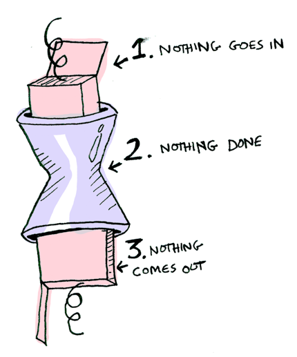

mi# Functores, Applicatives e Monads com figuras


e  você sabe como aplicar uma função cujo o argumento  é o  valor acima,


Muito simples! Vamos estender isso dizendo que qualquer valor pode estar dentro de um contexto. Um recurso didático é imaginar que o contexto é uma caixa na qual você pode colocar um valor dentro


Agora quando você aplica uma função a este valor, você receberá diferentes resultados dependendo do seu contexto. Esta é a ideia que serve de alicerce para  Functors, Applicatives, Monads, Arrows(veja morfismos) etc.  O tipo  `Maybe` define dois contextos

```haskell
data Maybe a = Nothing | Just a
```

Posteriormente eu lhe mostrarei as diferenças quando se aplica uma função quando algo é um `Just` ou `Nothing`, mas antes disso vamos conversar um pouco sobre Functors!


## Functors

Quando um valor está dentro de um contexto ele não permite a aplicação de uma função "ordinária" à ele


Aqui é onde o `fmap` surge.  `fmap` tem consciência do contexto. `fmap` sabe como atuar funções em valores
que estão envoltos por um contexto. Por exemplo, suponha que você queira
aplicar `(+3)` para `Just 2`. Usando `fmap`

```haskell
> fmap (+3) (Just 2)
Just 5
```


Bum! `fmap` shows us how it’s done!  Mas como  `fmap` sabe como aplicar a função?

### Primieramente, o que é um functor?

Functor is a typeclass. Here’s the definition:


A Functor is any data type that defines how fmap applies to it. Here’s how fmap works:

So we can do this:

```haskell
> fmap (+3) (Just 2)
Just 5
```

And fmap magically applies this function, because Maybe is a Functor. It specifies how fmap applies to Justs and Nothings:
```haskell
instance Functor Maybe where
    fmap func (Just val) = Just (func val)
    fmap func Nothing = Nothing
```


Here’s what is happening behind the scenes when we write fmap (+3) (Just 2):


So then you’re like, alright fmap, please apply (+3) to a Nothing?


```haskell
> fmap (+3) Nothing
Nothing
```


Bill O’Reilly being totally ignorant about the Maybe functor

Like Morpheus in the Matrix, `fmap` knows just what to do; you start with Nothing, and you end up with Nothing! `fmap` is zen. Now it makes sense why the `Maybe` data type exists. For example, here’s how you work with a database record in a language without `Maybe`:

```
post = Post.find_by_id(1)
if post
  return post.title
else
  return nil
end
```

But in Haskell:

```haskell
fmap (getPostTitle) (findPost 1)
```

If `findPost` returns a post, we will get the title with `getPostTitle`. If it returns `Nothing`, we will return `Nothing`! Pretty neat, huh? `<$>` is the infix version of `fmap`, so you will often see this instead:

```
getPostTitle <$> (findPost 1)
```

Here’s another example: what happens when you apply a function to a list?


Lists are functors too! Here’s the definition:

```haskell
instance Functor [] where
    fmap = map
```

Okay, okay, one last example: what happens when you apply a function to another function?

```haskell
fmap (+3) (+1)
```

Here’s a function:


Here’s a function applied to another function:


The result is just another function!

```haskell
> import Control.Applicative
> let foo = fmap (+3) (+2)
> foo 10
15
```

So functions are Functors too!

```haskell
instance Functor ((->) r) where
    fmap f g = f . g
```

When you use fmap on a function, you’re just doing function composition!

## Applicatives

Applicatives take it to the next level. With an applicative, our values are wrapped in a context, just like Functors:


But our functions are wrapped in a context too!


Yeah. Let that sink in. Applicatives don’t kid around. Control.Applicative defines `<*>`, which knows how to apply a function wrapped in a context to a value wrapped in a context:


i.e:
```haskell
Just (+3) <*> Just 2 == Just 5
```

Using `<*>` can lead to some interesting situations. For example:

```haskell
> [(*2), (+3)] <*> [1, 2, 3]
[2, 4, 6, 4, 5, 6]
```


Here’s something you can do with Applicatives that you can’t do with Functors. How do you apply a function that takes two arguments to two wrapped values?

```haskell
> (+) <$> (Just 5)
Just (+5)
> Just (+5) <$> (Just 4)
ERROR ??? WHAT DOES THIS EVEN MEAN WHY IS THE FUNCTION WRAPPED IN A JUST
```

Applicatives:

```haskell
> (+) <$> (Just 5)
Just (+5)
> Just (+5) <*> (Just 3)
Just 8
```

Applicative pushes Functor aside. “Big boys can use functions with any number of arguments,” it says. “Armed <$> and `<*>`,
 I can take any function that expects any number of unwrapped values. Then I pass it all wrapped values, and I get a wrapped value out! AHAHAHAHAH!”

```
> (*) <$> Just 5 <*> Just 3
Just 15
And hey! There’s a function called liftA2 that does the same thing:
> liftA2 (*) (Just 5) (Just 3)
Just 15
```

## Monads

How to learn about Monads:
1. Get a PhD in computer science.
2. Throw it away because you don’t need it for this section!

Monads add a new twist.
Functors apply a function to a wrapped value:


Applicatives apply a wrapped function to a wrapped value:


Monads apply a function that returns a wrapped value to a wrapped value. Monads have a function >>= (pronounced “bind”) to do this.
Let’s see an example. Good ol’ Maybe is a monad:


Just a monad hanging out
Just a monad hanging out
Suppose half is a function that only works on even numbers:

```
half x = if even x
           then Just (x `div` 2)
           else Nothing
```


What if we feed it a wrapped value?


We need to use >>= to shove our wrapped value into the function. Here’s a photo of >>=:


Here’s how it works:

```
> Just 3 >>= half
Nothing
> Just 4 >>= half
Just 2
> Nothing >>= half
Nothing
```

What’s happening inside? Monad is another typeclass. Here’s a partial definition:

```
class Monad m where
    (>>=) :: m a -> (a -> m b) -> m b
Where >>= is:
```


So Maybe is a Monad:

```

instance Monad Maybe where
    Nothing >>= func = Nothing
    Just val >>= func  = func val
```

Here it is in action with a Just 3!


And if you pass in a Nothing it’s even simpler:



You can also chain these calls:
```
> Just 20 >>= half >>= half >>= half
Nothing
```


Cool stuff! So now we know that Maybe is a Functor, an Applicative, and a Monad.
Now let’s mosey on over to another example: the IO monad:

Specifically three functions. getLine takes no arguments and gets user input:


```
getLine :: IO String
```

readFile takes a string (a filename) and returns that file’s contents:


readFile :: FilePath -> IO String

putStrLn takes a string and prints it:


putStrLn :: String -> IO ()

All three functions take a regular value (or no value) and return a wrapped value. We can chain all of these using >>=!


getLine >>= readFile >>= putStrLn
Aw yeah! Front row seats to the monad show!
Haskell also provides us with some syntactical sugar for monads, called do notation:
```
foo = do
    filename <- getLine
    contents <- readFile filename
    putStrLn contents
```

## Conclusion

A functor is a data type that implements the Functor typeclass.
An applicative is a data type that implements the Applicative typeclass.
A monad is a data type that implements the Monad typeclass.
A Maybe implements all three, so it is a functor, an applicative, and a monad.
What is the difference between the three?

